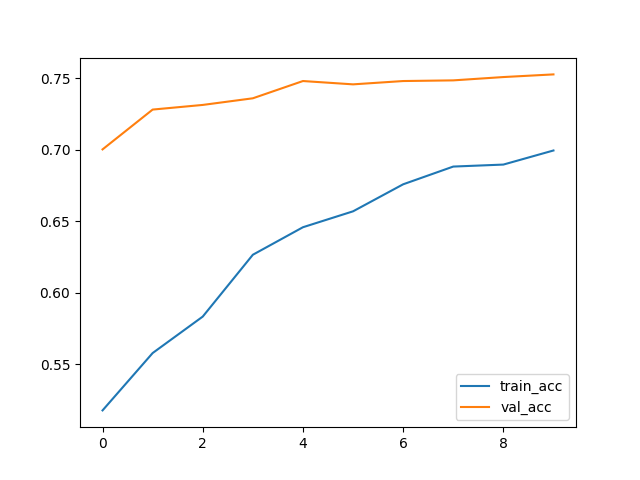
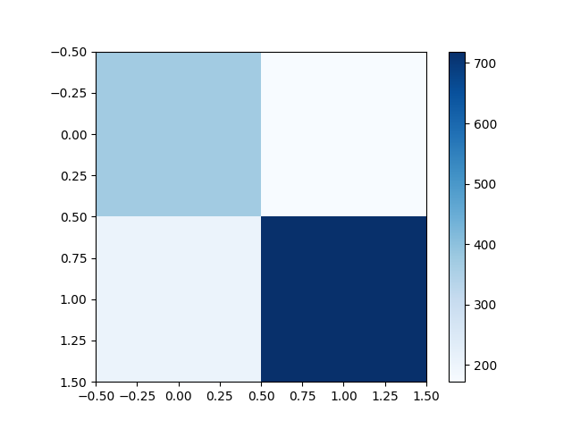
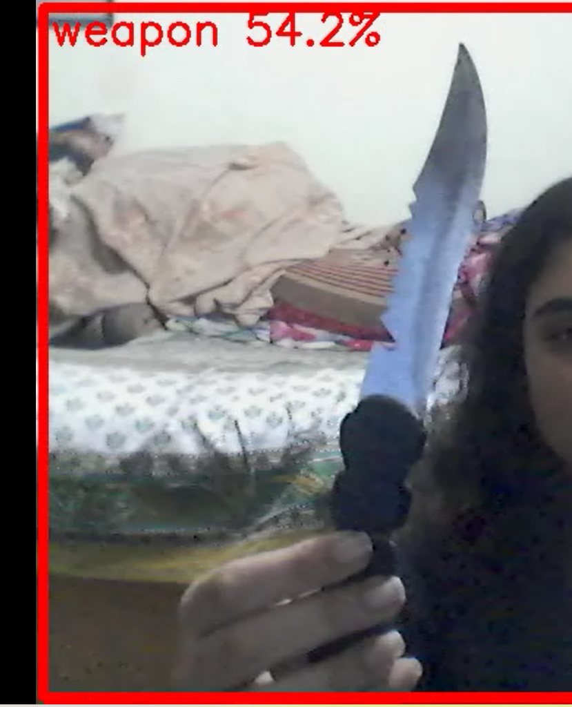

# 🔒 Project Title: Weapon Detection System

## 📝 Short Description

A deep learning-based system for detecting weapons in video streams to enhance public safety.  
**Security Goal:** Early detection of weapons to prevent potential threats.

---

## 📂 Dataset

- **Source(s):** [Kaggle](https://www.kaggle.com/), [Roboflow](https://roboflow.com/)
- **Classes:**
  - Guns: XX images
  - Knives: XX images
  - Others/Background: XX images
- **Preprocessing:**
  - Resized to 224x224
  - Normalized pixel values (0–1)
  - Data augmentation: rotation, flipping, brightness adjustments

---

## 🧠 Model

- **Architecture:** ResNet50 (Transfer Learning)
- **Input Size:** 224 × 224 × 3
- **Hyperparameters:**
  - Optimizer: Adam
  - Learning Rate: 0.001
  - Batch Size: 32
  - Loss: CrossEntropyLoss
- **Training:** XX epochs

---

## ⚙️ How to Run

### 1. Setup Virtual Environment & Install Dependencies

```bash
python -m venv venv
.\venv\Scripts\activate
pip install -r requirements.txt
```

## 🚀 Usage

### 2. Train Model

```bash
python src/train.py
```

### 3. Evaluate Model

```bash
python src/evaluate.py
```

### 4. Run Video Inference

```bash
python src/predict.py --video path/to/file.mp4 --out results/out.mp4 --skip 3
```

## 📸 Screenshot

### Training Curves



### Evaluation Metrics



<!-- ### Sample Annotated Video Frames -->

<!-- 
 -->
