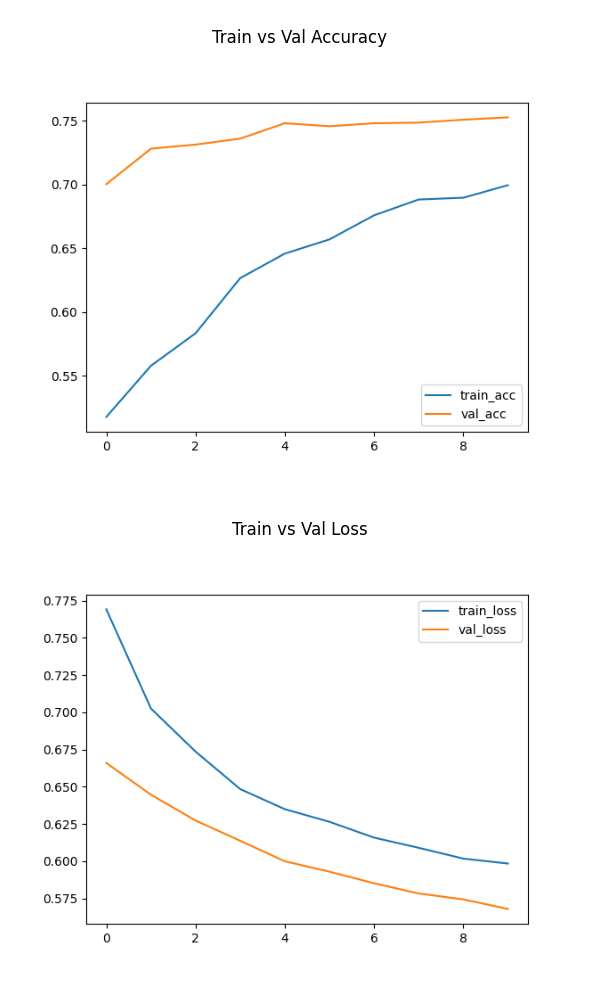

# 🔒 Project Title: Weapon Detection System

## 📝 Short Description

A deep learning-based system for detecting weapons (guns, knives) in video streams using **ResNet50 transfer learning**.  
**Security Goal:** Early detection of weapons to enhance public safety and prevent potential threats.

---

## 📂 Dataset

- **Source(s):** [Roboflow](https://roboflow.com/)
- **Classes:**

  - Guns: XX images
  - Knives: XX images

- **Preprocessing:**
  - Resized to **224×224**
  - Normalized pixel values (0–1)
  - Data augmentation: rotation, flipping, brightness adjustments

---

## 🧠 Model

- **Architecture:** ResNet50 (Transfer Learning)
- **Input Size:** 224 × 224 × 3
- **Hyperparameters:**
  - Optimizer: Adam
  - Learning Rate: 0.001
  - Batch Size: 32
  - Loss: CrossEntropyLoss
- **Training:** XX epochs

---

## ⚙️ How to Run

### 1. Setup Virtual Environment & Install Dependencies

```bash
python -m venv venv
.\venv\Scripts\activate
pip install -r requirements.txt
```

### 2. Train Model

```bash
python src/train.py
```

### 3. Evaluate Model

```bash
python src/evaluate.py
```

### 4. Run Video Inference

```bash
python src/predict.py
```

### 5. Outputs / Screenshots

#### Training Curves



#### Evaluation Metrics


#### Sample Detection (Video)

- **Green Box** → No Weapon
- **Red Box** → Weapon Detected
- Live probabilities are displayed on the frame


